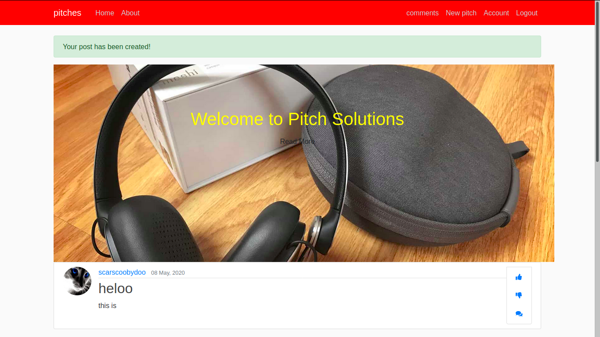

# Pitch Application
 

#### By:
1. Joseph Nganga ; lead developer
1. Moringa TM's ; Mentors
1. Moringa Students ; Assistant designers

# DESCRIPTION

This is a Python-Flask Application that allows users to create one minute pitch. You only have 60 seconds to impress someone. 1 minute can make or break you.
The users will submit their one minute pitches and other users will vote on them and leave comments to give their feedback on them.

## User Story

- Users can see the pitches other people have posted.

- Users can svote on the pitch they liked and give it a downvote or upvote.

- Users can sign in to leave a comment.

- Users can register on the website.

- Users can receive a welcoming email once they sign up.

- Users can view the pitches they have created in their profile page..

- Users can comment on the different pitches and leave feedback. 

- Users can submit a pitch in any category. 

- Users can view the different categories. 

## Known Bugs
If you find a bug (the website couldn't handle the query and / or gave undesired results), kindly open an issue here by including your search query and the expected result.

If you'd like to request a new function, feel free to do so by opening an issue here. Please include sample queries and their corresponding results
## Specifications

## setup /Installation Requirements
First clone the repo
   ```$ git clone  ```

After cloning, navigate to the project:
   `` $ cd news-flask``

Then install all the requirements through pip:
   ```$ pip install -r requirements.txt ```

Make the file executable:
   ```$ chmod +x start.sh```

Run the application:
   ```$ ./start.sh ```

Now navigate to your browser at: ```localhost:5000```


## Technologies Used
* Python
* Flask
* HTML5
* CSS3
* Bootstrap

## Support and contact details
call me on

:0798734442

:0778378174
 
 :nungari100@gmail.com

## License

[MIT License](LICENSE.md)
Copyright (c) [2020] [Joseph Nganga]
</a>
